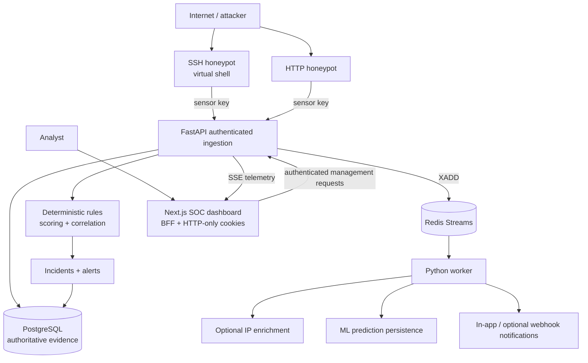

# HoneyPot -- Security Operations & Deception Platform

> A full-stack security operations and deception platform for capturing, processing, detecting, correlating, and investigating suspicious activity through isolated SSH and HTTP honeypots.

       

**Status:** locally validated on a native Windows runtime. **Production deployment is not active**; no public URL is claimed.

## Overview

HoneyPot turns controlled deception telemetry into evidence an analyst can investigate. Its SSH and HTTP decoys capture attacker interaction without executing attacker commands on the host. FastAPI validates and persists normalized events, deterministic rules create explainable detections, related activity is correlated into incidents, and a Next.js dashboard presents the SOC workflow in real time.

It is a safe sensor and analyst workflow, not a malware sandbox, public decoy deployment, or replacement for a mature enterprise SIEM.

## Key capabilities

| Area | Implemented capability |
| --- | --- |
| Deception | Concurrent AsyncSSH decoy with deterministic virtual shell; HTTP decoy with normalized telemetry and redacted headers. |
| Ingestion | Sensor-key authentication, Pydantic validation, body limits, idempotent event IDs, node heartbeats, and rate limiting. |
| Detection | 13 deterministic rules for brute force, commands, credential access, scanning, SQL injection, traversal, command injection, and scanner user agents. |
| Response | Transparent 0--100 risk scoring, 15-minute IP correlation, alert rules, notifications, acknowledgement, and resolution. |
| SOC experience | Dashboard, analytics, events, attackers, sessions, honeypots, alerts, threat intelligence, administration, audit logs, empty states, and recovery UI. |
| Identity | Argon2 hashes, JWT access tokens, rotating refresh tokens, logout revocation, ADMIN/ANALYST/VIEWER RBAC, and one-time reset. |
| Resilience | Redis Streams worker, health checks, API timeouts/retry UI, SSE reconnect, and local rate-limit fallback during Redis outages. |
| Enrichment and ML | Optional generic intelligence adapter; persisted logistic-regression predictions with synthetic development data. |

## Architecture



PostgreSQL and Redis are internal services. The API is the bridge between decoys and the management/data plane; decoys receive no database or Redis credentials. Container configuration further segments networks and applies non-root identities, dropped capabilities, `no-new-privileges`, resource limits, and read-only filesystems where practical.

## Event data flow

1. An attacker interacts with an SSH virtual shell or HTTP decoy.
2. The decoy posts normalized telemetry with `X-Sensor-Key`.
3. FastAPI validates size/schema, applies idempotency, and persists the event, attacker, node, and session.
4. Deterministic rules execute with 60-second context; evidence and an explainable risk score are stored.
5. Matching activity joins an unresolved same-IP incident within 15 minutes; alerts are created at qualifying thresholds.
6. After commit, the API writes an enrichment job to `honeypot:jobs` in Redis Streams.
7. The worker consumes and acknowledges jobs, attempts optional enrichment, persists ML output, and records notification state.
8. SSE emits telemetry; the dashboard invalidates cached views without a full reload.

## Technology stack

| Layer | Technology | Purpose |
| --- | --- | --- |
| Analyst UI | Next.js 16, React 19, TypeScript, Tailwind CSS, TanStack Query, Recharts | SOC routes, BFF, typed UI, caching, charts, recovery. |
| API | FastAPI, Pydantic, SQLAlchemy | Validated ingestion and management APIs. |
| Data | PostgreSQL, Alembic | Transactional evidence, relations, indexes, migrations. |
| Streams | Redis 8 / Redis Streams | Background jobs, heartbeats, pub/sub, rate-limit counters. |
| Sensors | AsyncSSH, FastAPI HTTP decoy | Controlled deception surfaces. |
| Security | PyJWT, pwdlib/Argon2, HMAC-SHA256 | Tokens, password hashes, sensor/webhook authentication. |
| ML | scikit-learn, joblib | Logistic-regression baseline and persisted predictions. |
| Quality | Pytest, Playwright, Ruff, ESLint, TypeScript | Unit, runtime/browser, lint, and type checks. |

## Security model

- **Backend-enforced RBAC:** `ADMIN`, `ANALYST`, and `VIEWER` checks live in FastAPI dependencies; hidden UI is not authorization.
- **Session safety:** short-lived typed JWT access tokens, hashed rotating refresh records, logout revocation, and HTTP-only BFF cookies. Enable `COOKIE_SECURE=true` behind HTTPS.
- **Reset hardening:** generic responses, rate limits, hashed/expiring one-time tokens, prior-token invalidation, refresh revocation, and optional HMAC-signed private webhook delivery.
- **Sensor boundary:** constant-time sensor-key comparison, strict validation, size limits, and decoys without PostgreSQL/Redis credentials.
- **Honeypot safety:** the SSH shell is allowlisted and never invokes a host shell, subprocess, `eval`, or `os.system` from attacker input.
- **Operations:** CORS configuration, security headers, audit logs, API timeouts, health checks, network isolation, and ignored secret files.

## ML baseline

The worker extracts aggregate incident features, loads a persisted logistic-regression model, calls `predict_proba`, and stores classification, confidence, model version, and features. The training generator uses **synthetic development data**. It verifies pipeline mechanics; it does not establish real-world detection accuracy.

## Repository guide

```text
apps/
  api/                FastAPI app, schemas, models, migrations, tests
  web/                Next.js SOC dashboard, BFF routes, Playwright tests
  worker/             Redis Stream consumer, enrichment, ML, notifications
  ssh-honeypot/       AsyncSSH service and virtual shell
  http-honeypot/      HTTP deception service
packages/sensor-sdk/  Shared sensor event support
ml/                   Data, features, training, evaluation, prediction
scripts/              Native setup/start and runtime validation
docs/                 Security, detection, verification, interview guide, handbook
docker-compose*.yml   Optional hardened container deployment topology
```

## Run locally on Windows

Docker is **not required** for the native validation workflow. Scripts provision repository-local PostgreSQL and native Redis, generate ignored local secrets, run migrations, and start the full stack on loopback.

### Prerequisites

- Windows 10/11, Python 3.12, Node.js 20+ (validated with Node 22), npm 10+, PowerShell
- Native Redis 8 Windows fork:

```powershell
winget install --id taizod1024.redis-windows-fork --source winget
```

### Setup and start

```powershell
py -3.12 -m venv .venv
.venv\Scripts\python -m pip install -r apps/api/requirements.txt -r apps/api/requirements-dev.txt -r ml/requirements.txt
.venv\Scripts\python -m pip install -e packages/sensor-sdk -r apps/ssh-honeypot/requirements.txt -r apps/http-honeypot/requirements.txt
Push-Location apps/web; npm.cmd ci; Pop-Location

# Creates ignored .runtime/native.env, initializes PostgreSQL, and starts PostgreSQL + Redis.
powershell -NoProfile -ExecutionPolicy Bypass -File scripts/native-infra.ps1 setup

# Generates the development-only model, builds the dashboard, migrates, and starts API, worker, decoys, and web.
.venv\Scripts\python -m ml.train
powershell -NoProfile -ExecutionPolicy Bypass -File scripts/native-stack.ps1 start
```

Native services bind to loopback: dashboard `127.0.0.1:3000`, API `127.0.0.1:8000`, HTTP decoy `127.0.0.1:8080`, SSH decoy `127.0.0.1:2222`, PostgreSQL `127.0.0.1:55432`, Redis `127.0.0.1:56379`. Register the exact `BOOTSTRAP_ADMIN_EMAIL` from ignored `.runtime/native.env`; the first matching account becomes `ADMIN`.

## Validation

Latest recorded native Windows status: **mostly validated**.

| Check | Result |
| --- | --- |
| Ruff | PASS |
| Pytest | PASS -- 18 tests after authentication/reset hardening |
| Alembic native PostgreSQL migration | PASS -- revision `0002` |
| ESLint / TypeScript / Next.js production build | PASS |
| PostgreSQL / Redis / FastAPI / worker | PASS |
| SSH and HTTP honeypots | PASS, including virtual-shell host-escape negative test |
| Detection rules | PASS -- all 13 through live authenticated ingestion |
| Incident lifecycle / RBAC / refresh / logout | PASS |
| ML persistence | PASS |
| Playwright | PASS -- login, ingestion, investigation, acknowledge, resolve, major SOC routes |
| SSE | PASS -- live update and reconnect/recovery coverage |

```powershell
.venv\Scripts\python -m ruff check apps packages ml scripts
.venv\Scripts\python -m pytest
Push-Location apps/web; npm.cmd run lint; npm.cmd run typecheck; npm.cmd run build; Pop-Location
powershell -NoProfile -ExecutionPolicy Bypass -File scripts/native-stack.ps1 start
.venv\Scripts\python scripts/validate_honeypots.py
.venv\Scripts\python scripts/validate_detection_pipeline.py
.venv\Scripts\python scripts/validate_auth_runtime.py
```

## Documentation

- [Complete Technical Handbook (PDF)](docs/HoneyPot_Complete_Technical_Handbook.pdf)
- [Handbook source (LaTeX)](docs/HoneyPot_Complete_Technical_Handbook.tex)
- [Detection and scoring](docs/DETECTION.md)
- [Security model](docs/SECURITY.md)
- [Verification report](docs/VERIFICATION.md)
- [Interview guide](docs/INTERVIEW_GUIDE.md)

## Known limitations

- Production deployment and public HTTPS validation have not been completed.
- External threat-intelligence providers were not exercised without credentials.
- No real password-reset webhook receiver or delivery endpoint was exercised.
- The controlled API-failure dashboard browser scenario remains partially tested.
- Docker/container network isolation and TLS runtime were not used in native validation.
- The ML dataset is synthetic development data, not evidence of real-world model accuracy.
- FTP, Telnet, and MySQL decoys are extension points, not implemented sensors.

## Roadmap

- [ ] Deploy behind HTTPS with private PostgreSQL/Redis and reviewed sensor isolation.
- [ ] Integrate external threat-intelligence providers.
- [ ] Train/evaluate ML with governed real-world data and drift monitoring.
- [ ] Add safely isolated sensors and per-sensor identities.
- [ ] Add production observability, backups, and SIEM integration.

## What this project demonstrates

Full-stack engineering, relational data modeling, asynchronous stream processing, real-time UI design, authentication/RBAC, security boundaries, explainable detection, responsible ML integration, browser testing, and resilience-oriented operational design.

## Deployment note

Production deployment is not active. Any future deployment must keep PostgreSQL, Redis, worker, secrets, and management interfaces private; isolated decoys require separate review and must never execute attacker commands on a host.
